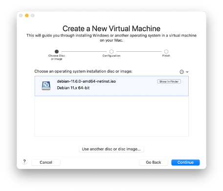
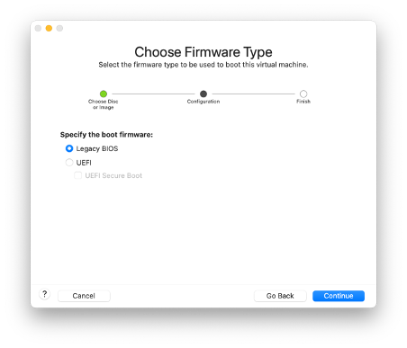
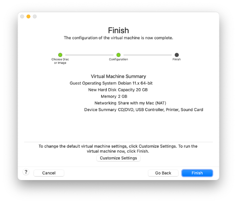
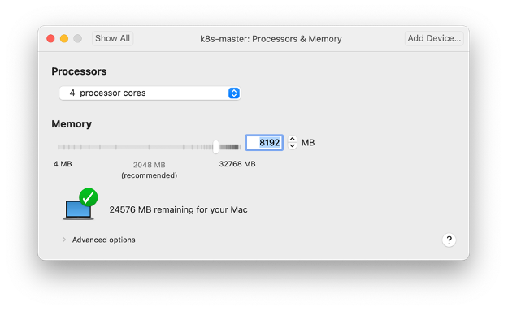
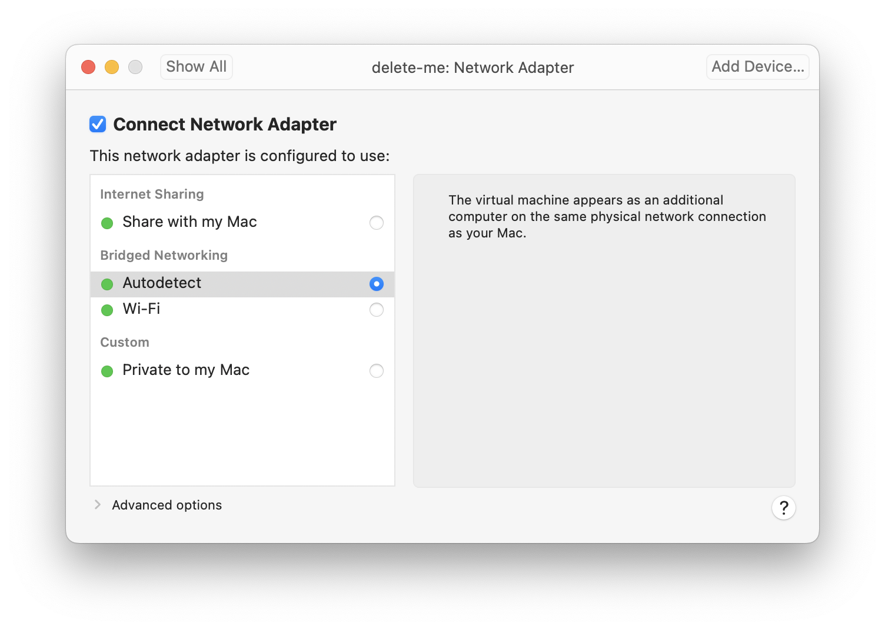
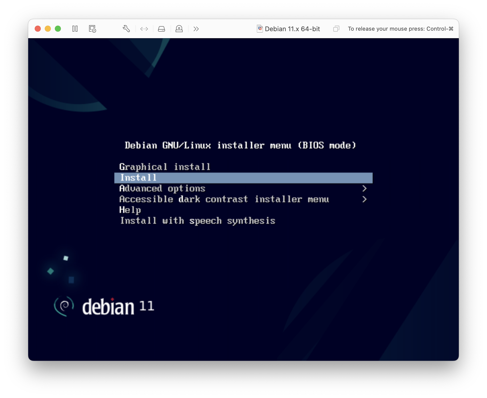
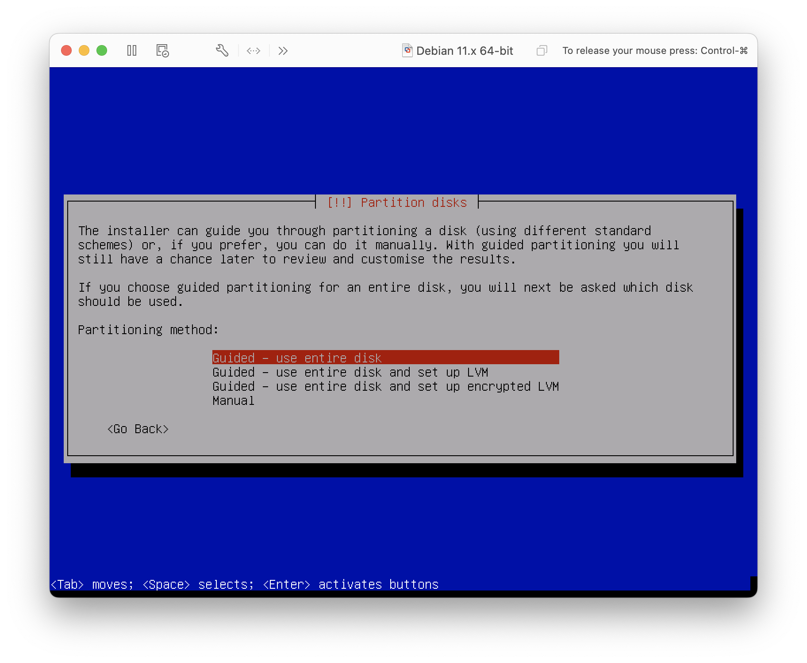
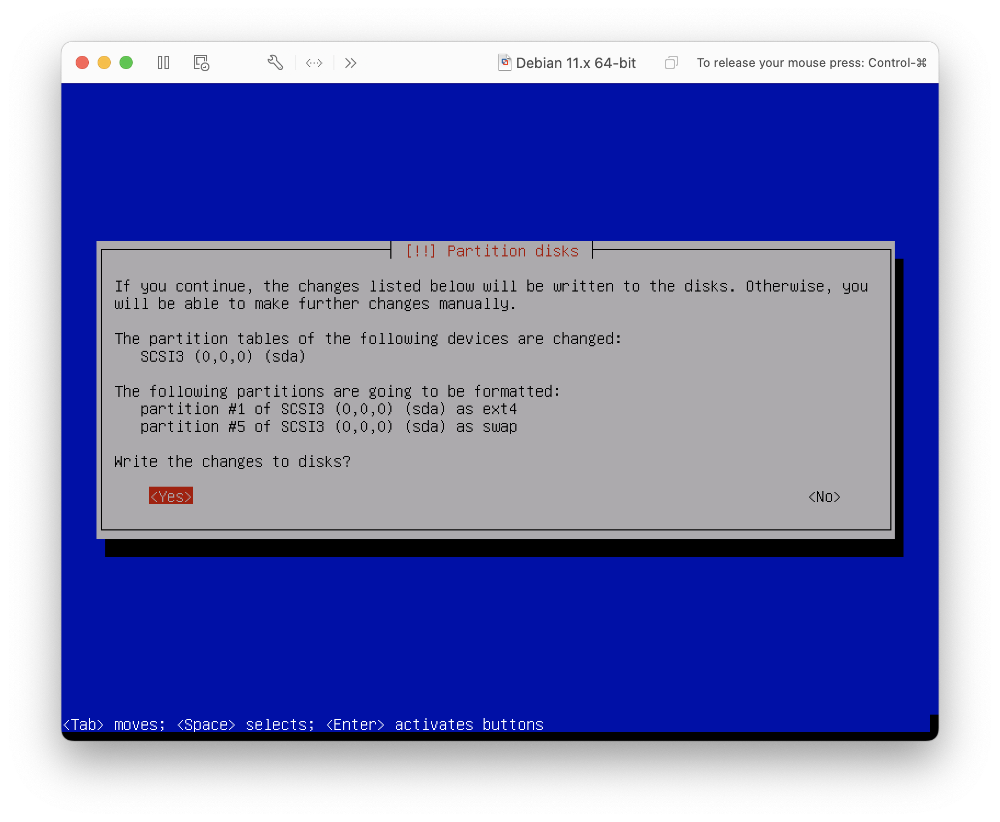
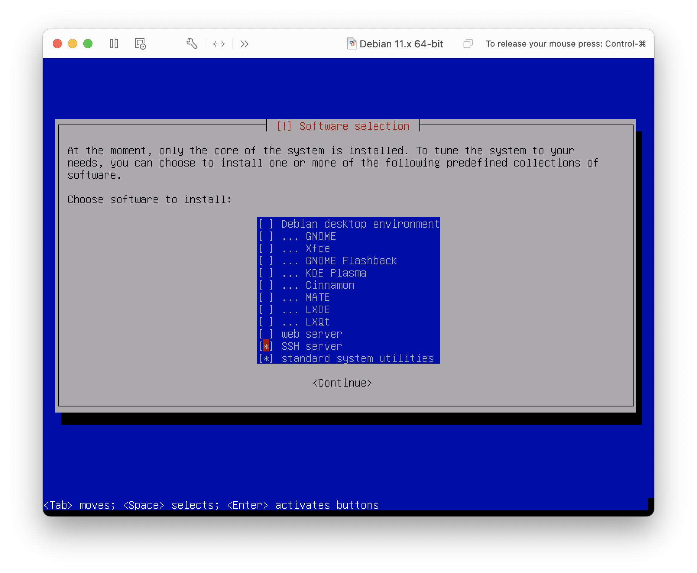

# Setup a Kubernetes Cluster with Kubeadm on Debian 11
## Last Version
|Name|Version|
|:---|:---|
|**VMware Fusion**|13.0.1|
|**Debian Bullseye**|11.6.0|
|**Kernel**|6.1.0-0|
|**Docker-CE**|23.0.3|
|**K8s**|1.26.3|
|**Cilium**|1.13.1|
|**cri-dockerd**|0.3.1|

# Introduction
The step-by-step guide demonstrates you how to install Kubernetes cluster on Debian 11 with Kubeadm utility. All the Debian host are running as VMs in VMware Fusion on macOS.

This Kubernetes (K8s) cluster have one master and two worker nodes. Master node works as the control plane and the worker nodes runs the actual container(s).

**This tutorial in not meant for production installation and is not a tutorial on Debian intallation**. The tutorial main goal is to understand how to install a basic K8s cluster.

In this tutorial, you will set up a Kubernetes Cluster by:

- Setting up three Debian 11 virtual machines with a Kernel 6.1.0
- Installing Docker-CE and Docker Compose plugin
- Installing Kubernetes kubelet, kubeadm, and kubectl
- Installing a CNI Plugin (Cilium)
- Configuring Docker as the container runtime for Kubernetes
- Initializing one K8s master node and adding two worker nodes

# Prerequisites
To complete this tutorial, you will need the following:

- Three or more physical/virtual Debian 11 servers
- Minimum of 2 CPU / vCPU with 8 GB RAM for the master node
- 20 GB free disk space
- Internet Connectivity

# Lab Setup
For this tutorial, I will be using three Debian 11 systems with following hostnames and IP addresses:

- Master Node 1 (k8smaster1) - 192.168.13.30
- Worker Node 1 (k8sworker1) - 192.168.13.31
- Worker Node 2 (k8sworker2) - 192.168.13.32

(<a href="#readme-top">back to top</a>)

# Download the IOS file
Download the [debian-11.6.0-amd64-netinst.iso](https://cdimage.debian.org/debian-cd/current/amd64/iso-cd/debian-11.6.0-amd64-netinst.iso) from a Debian mirror site. Use the net install ISO.

# Create the virtual Machine (VMware Fusion)
I'm using VMware Fusion standard edition to create the Debian 11 VMs.

- Create a new virtual machine

- Choose the ISO and select the Legacy BIOS option

- Review and start the installation

- Make sure you have at least two vCPU (required for the master node)

- Choose Bridged Networking (the VMs in part of your local network)

(<a href="#readme-top">back to top</a>)

# Start the installation of Debian Linux
- Choose standard text installation

For the next few questions, choose you're
- Keyboard
- Location
- Hostname and domain name
- Root password
- Non-administrative username/password
- Timezone

- Choose Guided - use entire disk

- Don't forget to write the change to the disk 😀

- Make sure you unselect any graphical interface and you activate SSH server

# Finalize Debian installation
Use the VMware console to login with your root user account.

## Get the IP address of the VM
Find your network interface name and ip address with the command:

    ip addr

## SSH
Use SSH to access the VM. You should have the IP address for the step above. Use the non-administrative user since `root` is not allowed to SSH.
    ssh -l daniel 192.168.13.xxx

## Add sudo
Elevate yourself to `root`, install `sudo` and give your normal user `sudo` privileges.

    su - root
    apt install -y sudo
    echo "daniel ALL=(ALL:ALL) NOPASSWD: ALL" | sudo tee /etc/sudoers.d/daniel

## Configuring static IP address
Edit the `interfaces` file to configure a static IP address

    sudo nano /etc/network/interfaces

Add the following:

    allow-hotplug ens33
    iface ens33 inet static
        address 192.168.13.xx/24
        gateway 192.168.13.1
        # dns-* options are implemented by the resolvconf package, if installed
        dns-nameservers 9.9.9.9
        dns-search example.com

Log off completely and login again with your normal username

## Add entries in /etc/hosts
    cat >> /etc/hosts << "EOF"
    192.168.13.30   k8smaster1.example.com
    192.168.13.31   k8sworker1.example.com
    192.168.13.32   k8sworker2.example.com
    EOF

## Installing Linux kernel 6.x on Debian 11 (Optional)
I wanted to have a Linux kernel 6.x in my lab.

    echo "deb http://deb.debian.org/debian bullseye-backports main" | sudo tee -a /etc/apt/sources.list
    sudo apt update

## Install the new kernel with the following command:
    sudo apt -t bullseye-backports upgrade

## Once the Kernel has been installed, reboot the server with the command:
    sudo reboot

## List old kernels
    dpkg --list | grep linux-image

## Remove old kernels with the command:
    sudo apt-get --purge remove linux-image-5.10.0-20-amd64 linux-image-5.10.0-21-amd64

## After removing the old kernel, it's time to update the grub2 configuration:
    sudo update-grub2

## Generate ECC SSH public/private key pair
    ssh-keygen -q -t ecdsa -N '' -f ~/.ssh/id_ecdsa <<<y >/dev/null 2>&1

## K8s requires swap be disabled
K8s requires that swap partition is disabled on master and worker node of a cluster.

Disable swap with this command:

    sudo swapoff -a

Edit /etc/fstab and comment the swap line to disable it on future reboots.

    # UUID=9a4ad891-9f88-85564-89ae-5d730202abc8 none            swap    sw              0       0

## Fix backspace/arrows issue with VI in edit mode
If you like to use `vi`, this fixes a small issue with backspace not working and up/down/left/right arrows having a strange behavior:

    cat > ~/.vimrc << "EOF"
    :set nocompatible
    :set backspace=indent,eol,start
    EOF

You should have a standard Debian 11 installation with no graphical user interface, a non-administrative user account with `sudo`.

(<a href="#readme-top">back to top</a>)

# Install Docker-CE on Debian 11
This is applicable to master and worker node in a K8s cluster.

Install Prerequisites

    sudo apt install -y apt-transport-https ca-certificates curl gnupg lsb-release

Add Docker's Official GPG Key

    curl -fsSL https://download.docker.com/linux/debian/gpg | sudo gpg --dearmor -o /usr/share/keyrings/docker.gpg

Add Docker Repo to Debian 11

    echo "deb [arch=$(dpkg --print-architecture) signed-by=/usr/share/keyrings/docker.gpg] https://download.docker.com/linux/debian $(lsb_release -cs) stable" | sudo tee /etc/apt/sources.list.d/docker.list > /dev/null

Refresh the package list with the command:

    sudo apt update

To install the latest up-to-date Docker release on Debian, run the below command:

    sudo apt install -y docker-ce docker-ce-cli containerd.io docker-buildx-plugin docker-compose-plugin

Check the Docker service status using the following command:

    sudo systemctl is-active docker

Enabling your non-root user to run Docker Commands (Log out from the current terminal and log back in)

    sudo usermod -aG docker ${USER}

Check Docker's version (without sudo)

    docker version
    docker compose version

Verify that Docker is running:

    sudo systemctl status docker.service
    sudo systemctl status docker.socket
    sudo systemctl status containerd.service

Docker bash completion: If you installed `docker-ce-cli` package, it already ships with bash-completion files:

    dpkg -L docker-ce-cli | grep completion

The steps above installed the following Docker components:

- docker-ce: The Docker engine itself.
- docker-ce-cli: A command line tool that lets you talk to the Docker daemon.
- containerd.io: A container runtime that manages the container’s lifecycle.
- docker-buildx-plugin: A CLI plugin that extends the Docker build with many new features.
- docker-compose-plugin: A configuration management plugin to orchestrate the creation and management of Docker containers through compose files.

(<a href="#readme-top">back to top</a>)

# Install cri-dockerd on Debian 11
First, let's get the latest release version of `cri-docker`:

    VER=$(curl -s https://api.github.com/repos/Mirantis/cri-dockerd/releases/latest|grep tag_name | cut -d '"' -f 4|sed 's/v//g')

    echo $VER

Download and extract the archive file from Github `cri-docker` releases page:

    wget https://github.com/Mirantis/cri-dockerd/releases/download/v${VER}/cri-dockerd-${VER}.amd64.tgz
    tar xvf cri-dockerd-${VER}.amd64.tgz

Move `cri-dockerd` binary package to `/usr/local/bin` directory with the command:

    sudo mv cri-dockerd/cri-dockerd /usr/local/bin/

Validate successful installation by running the commands below:

    cri-dockerd --version

Configure systemd units for cri-dockerd:

    wget https://raw.githubusercontent.com/Mirantis/cri-dockerd/master/packaging/systemd/cri-docker.service
    wget https://raw.githubusercontent.com/Mirantis/cri-dockerd/master/packaging/systemd/cri-docker.socket
    sudo mv cri-docker.socket cri-docker.service /etc/systemd/system/
    sudo sed -i -e 's,/usr/bin/cri-dockerd,/usr/local/bin/cri-dockerd,' /etc/systemd/system/cri-docker.service

Start and enable the services with the following commands:

    sudo systemctl daemon-reload
    sudo systemctl enable cri-docker.service
    sudo systemctl enable --now cri-docker.socket

Check the status of the services with the commands:

    sudo systemctl status cri-docker.service
    sudo systemctl status cri-docker.socket

Clean up the package downloaded:

    rm -rf cri-dockerd cri-dockerd-${VER}.amd64.tgz

(<a href="#readme-top">back to top</a>)

# Install K8s (master & worker)
Finally the fun part 😀

This should be done on the master and worker nodes of a K8s cluster.

Install packages dependency (should already be installed from the Docker section):

    sudo apt install -y apt-transport-https ca-certificates curl

Download the Google Cloud public (GCP) signing key using curl command:

    sudo curl -fsSLo /usr/share/keyrings/kubernetes-archive-keyring.gpg https://packages.cloud.google.com/apt/doc/apt-key.gpg

Add Kubernetes APT Repository:

    echo "deb [signed-by=/usr/share/keyrings/kubernetes-archive-keyring.gpg] https://apt.kubernetes.io/ kubernetes-xenial main" | sudo tee /etc/apt/sources.list.d/kubernetes.list

Update the software package index:
    sudo apt update

Install Kubernetes with the following commands:

    sudo apt install kubectl kubeadm kubelet kubernetes-cni

Optional:

    sudo apt-mark hold kubelet kubeadm kubectl

Verify K8s version (v1.26.3):

    kubectl version --output=yaml
    kubeadm version --output=yaml
    kubectl version --output=yaml

Enable kubectl autocompletion for Bash:

    sudo kubectl completion bash | sudo tee /etc/bash_completion.d/kubectl > /dev/null

After reloading your shell, kubectl autocompletion should be working.
    source ~/.bashrc

(<a href="#readme-top">back to top</a>)

# Configure a K8s master node
This should only be done on the master node of a K8s cluster. Initialize the master node with the command:

    sudo kubeadm init --cri-socket unix:///var/run/cri-dockerd.sock

This should be the result of the `init` command:

    Your Kubernetes control-plane has initialized successfully!

    To start using your cluster, you need to run the following as a regular user:

    mkdir -p $HOME/.kube
    sudo cp -i /etc/kubernetes/admin.conf $HOME/.kube/config
    sudo chown $(id -u):$(id -g) $HOME/.kube/config

    Alternatively, if you are the root user, you can run:

    export KUBECONFIG=/etc/kubernetes/admin.conf

    You should now deploy a pod network to the cluster.
    Run "kubectl apply -f [podnetwork].yaml" with one of the options listed at:
    https://kubernetes.io/docs/concepts/cluster-administration/addons/

    Then you can join any number of worker nodes by running the following on each as root:

    kubeadm join 192.168.13.30:6443 --token yb1fqq.as5uf76jzsi8ulhf \
        --discovery-token-ca-cert-hash sha256:5b11f6adfcdceb74d3ca2f40a9f3e5086d7898759e5b1ce66a2d7d79b4bef576

Check the status of the master with the command:

    kubectl get nodes

    NAME         STATUS     ROLES           AGE   VERSION
    k8smaster1   NotReady   control-plane   4m    v1.26.3

The status is NotReady because we didn't install a pod network.

(<a href="#readme-top">back to top</a>)

## Configure the k8s worker node
This should only be done on worker node of a K8s cluster.

Join the worker node to the master node with the command:

    sudo kubeadm join 192.168.13.30:6443 --token yb1fqq.as5uf76jzsi8ulhf \
    --cri-socket unix:///var/run/cri-dockerd.sock \
    --discovery-token-ca-cert-hash sha256:5b11f6adfcdceb74d3ca2f40a9f3e5086d7898759e5b1ce66a2d7d79b4bef576

    [preflight] Running pre-flight checks
    [preflight] Reading configuration from the cluster...
    [preflight] FYI: You can look at this config file with 'kubectl -n kube-system get cm kubeadm-config -o yaml'
    [kubelet-start] Writing kubelet configuration to file "/var/lib/kubelet/config.yaml"
    [kubelet-start] Writing kubelet environment file with flags to file "/var/lib/kubelet/kubeadm-flags.env"
    [kubelet-start] Starting the kubelet
    [kubelet-start] Waiting for the kubelet to perform the TLS Bootstrap...

    This node has joined the cluster:
    * Certificate signing request was sent to apiserver and a response was received.
    * The Kubelet was informed of the new secure connection details.

Check that the worker nodes have joined the cluster and they're ready:

    kubectl get nodes

    NAME         STATUS   ROLES           AGE   VERSION
    k8smaster1   Ready    control-plane   28m   v1.26.3
    k8sworker1   Ready    <none>          85s   v1.26.3
    k8sworker2   Ready    <none>          66s   v1.26.3

(<a href="#readme-top">back to top</a>)

## Install Cilium
We're going to use Cilium as our CNI networking solution. Cilium is an incubating CNCF project that implements a wide range of networking, security and observability features, much of it through the Linux kernel eBPF facility. This makes Cilium fast and resource efficient. Cilium offers a command line tool that we can use to install the CNI components.
1.	Download
2.	Extract
3.	Install and test the Cilium CLI:

Download the package:

    wget https://github.com/cilium/cilium-cli/releases/latest/download/cilium-linux-amd64.tar.gz

Extract it:

    sudo tar xzvfC cilium-linux-amd64.tar.gz /usr/local/bin

Install the cilium CNI:

    cilium install

Check the cilium status:

    cilium status

Check that the master node is ready:

    kubectl get nodes

    NAME         STATUS   ROLES           AGE   VERSION
    k8smaster1   Ready    control-plane   22h   v1.26.3
    k8sworker1   Ready    <none>          22h   v1.26.3
    k8sworker2   Ready    <none>          22h   v1.26.3

    kubectl get pod -A

    NAMESPACE     NAME                                 READY   STATUS    RESTARTS        AGE
    kube-system   cilium-cjp26                         1/1     Running   0               103s
    kube-system   cilium-operator-56486f49cd-7p2j5     1/1     Running   0               103s
    kube-system   cilium-srfjx                         1/1     Running   0               103s
    kube-system   cilium-zhvcj                         1/1     Running   0               103s
    kube-system   coredns-787d4945fb-294tz             1/1     Running   3 (8m36s ago)   22h
    kube-system   coredns-787d4945fb-q4mc8             1/1     Running   0               57s
    kube-system   etcd-k8smaster1                      1/1     Running   3 (8m41s ago)   22h
    kube-system   kube-apiserver-k8smaster1            1/1     Running   5 (7m52s ago)   22h
    kube-system   kube-controller-manager-k8smaster1   1/1     Running   3 (8m41s ago)   22h
    kube-system   kube-proxy-bmgjw                     1/1     Running   3 (8m41s ago)   22h
    kube-system   kube-proxy-nwt9b                     1/1     Running   2 (15h ago)     22h
    kube-system   kube-proxy-vsb96                     1/1     Running   2 (15h ago)     22h
    kube-system   kube-scheduler-k8smaster1            1/1     Running   3 (8m41s ago)   22h

Delete the package with the command:

    rm -f cilium-linux-amd64.tar.gz

Verify Kubectl Configuration:

    sudo systemctl status kubelet.service
    kubectl version --output=yaml

## License
Distributed under the MIT License. See [LICENSE](LICENSE) for more information.

(<a href="#readme-top">back to top</a>)

## Contact
Daniel Della-Noce - [Linkedin](https://www.linkedin.com/in/daniel-della-noce-2176b622/) - daniel@isociel.com  
Project Link: [https://github.com/ddella/Debian11-Docker-K8s](https://github.com/ddella/Debian11-Docker-K8s)

(<a href="#readme-top">back to top</a>)

