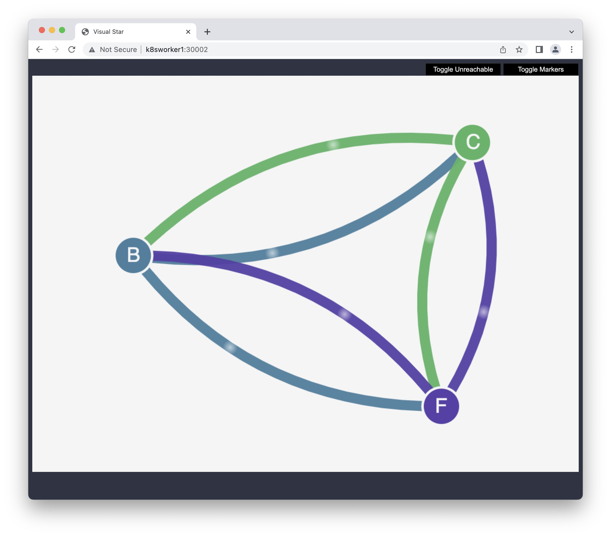
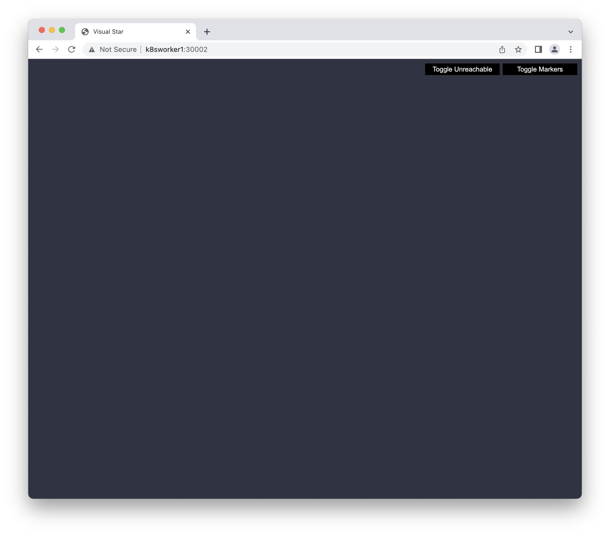
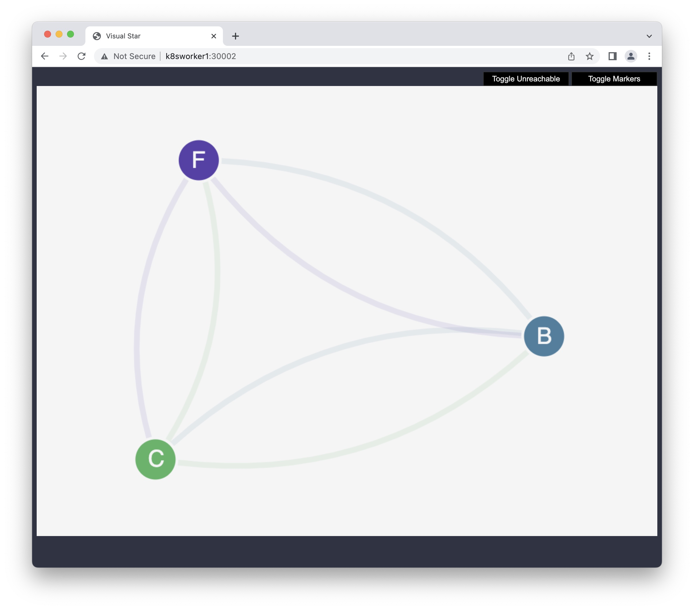
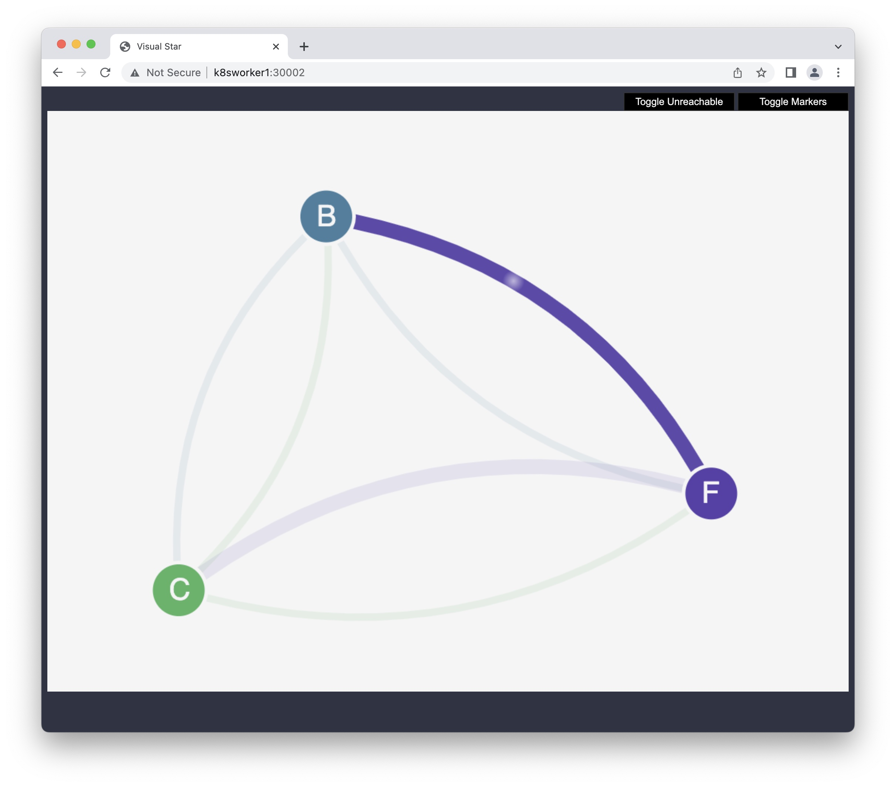

# Stars policy demo

This section walks through the Stars policy demo provided by the Project Calico documentation and isn't necessary for Calico functionality on your cluster. The demo creates a front-end, back-end, and client service on your Amazon EKS cluster. The demo also creates a management graphical user interface that shows the available ingress and egress paths between each service. We recommend that you complete the demo on a cluster that you don't run production workloads on.

Before you create any network policies, all services can communicate bidirectionally. After you apply the network policies, you can see that the client can only communicate with the front-end service, and the back-end only accepts traffic from the front-end.

## Start the Stars policy demo
```sh
kubectl --kubeconfig=$HOME/.kube/eks-calicoebpf apply -f https://docs.projectcalico.org/v3.5/getting-started/kubernetes/tutorials/stars-policy/manifests/00-namespace.yaml
kubectl --kubeconfig=$HOME/.kube/eks-calicoebpf apply -f https://docs.projectcalico.org/v3.5/getting-started/kubernetes/tutorials/stars-policy/manifests/01-management-ui.yaml
kubectl --kubeconfig=$HOME/.kube/eks-calicoebpf apply -f https://docs.projectcalico.org/v3.5/getting-started/kubernetes/tutorials/stars-policy/manifests/02-backend.yaml
kubectl --kubeconfig=$HOME/.kube/eks-calicoebpf apply -f https://docs.projectcalico.org/v3.5/getting-started/kubernetes/tutorials/stars-policy/manifests/03-frontend.yaml
kubectl --kubeconfig=$HOME/.kube/eks-calicoebpf apply -f https://docs.projectcalico.org/v3.5/getting-started/kubernetes/tutorials/stars-policy/manifests/04-client.yaml
```

View all Pods on the cluster.

```sh
kubectl --kubeconfig=$HOME/.kube/eks-calicoebpf get pods -n client
```

```
NAME           READY   STATUS    RESTARTS   AGE
client-7rhfn   1/1     Running   0          15m
```

```sh
kubectl --kubeconfig=$HOME/.kube/eks-calicoebpf get pods -n stars
```

```
NAME             READY   STATUS    RESTARTS   AGE
backend-dzkh2    1/1     Running   0          15m
frontend-qcr46   1/1     Running   0          15m
```

```sh
kubectl --kubeconfig=$HOME/.kube/eks-calicoebpf get pods -n management-ui
```

```
NAME                  READY   STATUS    RESTARTS   AGE
management-ui-k622m   1/1     Running   0          15m
```

To connect to the management user interface via a browser, start a load balancer to listen on local port `9001` to the `management-ui` service running on your EKS cluster:
```sh
cat > management-ui-lb.yaml<< EOF
apiVersion: v1
kind: Service
metadata:
  name: management-ui
  namespace: management-ui
spec:
  selector:
    role: management-ui
  ports:
    - port: 9001
      targetPort: 9001
  type: LoadBalancer
EOF
```

```sh
kubectl --kubeconfig=$HOME/.kube/eks-calicoebpf apply -f management-ui-lb.yaml
kubectl --kubeconfig=$HOME/.kube/eks-calicoebpf get svc -n management-ui
```

You will use the external IP to access the page:
```
NAME            TYPE           CLUSTER-IP     EXTERNAL-IP                                                              PORT(S)          AGE
management-ui   LoadBalancer   10.250.22.73   aabf5dc23e6934afc8b2c2cd659b112b-106276692.us-east-2.elb.amazonaws.com   9001:30002/TCP   21m
```

## No Policy
Open a browser on your local system and point it to `http://aabf5dc23e6934afc8b2c2cd659b112b-106276692.us-east-2.elb.amazonaws.com:9001`. You should see the management user interface. The `C` node is the client service, the `F` node is the front-end service, and the `B` node is the back-end service. Each node has full communication access to all other nodes, as indicated by the bold, colored lines.



## Deny All
Apply the following network policies to isolate the services from each other:
```sh
kubectl --kubeconfig=$HOME/.kube/eks-calicoebpf apply -n stars -f https://docs.projectcalico.org/v3.5/getting-started/kubernetes/tutorials/stars-policy/policies/default-deny.yaml
kubectl --kubeconfig=$HOME/.kube/eks-calicoebpf apply -n client -f https://docs.projectcalico.org/v3.5/getting-started/kubernetes/tutorials/stars-policy/policies/default-deny.yaml
```

Refresh your browser. You see that the management user interface can no longer reach any of the nodes, so they don't show up in the user interface. The page is blank.



Remove the network policy:
```sh
kubectl --kubeconfig=$HOME/.kube/eks-calicoebpf delete -n stars -f https://docs.projectcalico.org/v3.5/getting-started/kubernetes/tutorials/stars-policy/policies/default-deny.yaml
kubectl --kubeconfig=$HOME/.kube/eks-calicoebpf delete -n client -f https://docs.projectcalico.org/v3.5/getting-started/kubernetes/tutorials/stars-policy/policies/default-deny.yaml
```

## Allow UI
Apply the following network policies to allow the management user interface to access the services:

```sh
kubectl --kubeconfig=$HOME/.kube/eks-calicoebpf apply -f https://docs.projectcalico.org/v3.5/getting-started/kubernetes/tutorials/stars-policy/policies/allow-ui.yaml
kubectl --kubeconfig=$HOME/.kube/eks-calicoebpf apply -f https://docs.projectcalico.org/v3.5/getting-started/kubernetes/tutorials/stars-policy/policies/allow-ui-client.yaml
```



```sh
kubectl --kubeconfig=$HOME/.kube/eks-calicoebpf delete -f https://docs.projectcalico.org/v3.5/getting-started/kubernetes/tutorials/stars-policy/policies/allow-ui.yaml
kubectl --kubeconfig=$HOME/.kube/eks-calicoebpf delete -f https://docs.projectcalico.org/v3.5/getting-started/kubernetes/tutorials/stars-policy/policies/allow-ui-client.yaml
```

## front-end service to back-end service
Apply the following network policy to allow traffic from the front-end service to the back-end service:
```sh
kubectl --kubeconfig=$HOME/.kube/eks-calicoebpf apply -f https://docs.projectcalico.org/v3.5/getting-started/kubernetes/tutorials/stars-policy/policies/backend-policy.yaml
```



## client to front-end service
Apply the following network policy to allow traffic from the client to the front-end service.

```sh
kubectl --kubeconfig=$HOME/.kube/eks-calicoebpf apply -f https://docs.projectcalico.org/v3.5/getting-started/kubernetes/tutorials/stars-policy/policies/frontend-policy.yaml
```

Refresh your browser. You see that the client can communicate to the front-end service. The front-end service can still communicate to the back-end service.


```sh
kubectl --kubeconfig=$HOME/.kube/eks-calicoebpf delete -f https://docs.projectcalico.org/v3.5/getting-started/kubernetes/tutorials/stars-policy/policies/frontend-policy.yaml
```

## Cleanup

When you are done with the demo, you can delete its resources.

```sh
kubectl delete -f https://docs.projectcalico.org/v3.5/getting-started/kubernetes/tutorials/stars-policy/manifests/04-client.yaml
kubectl delete -f https://docs.projectcalico.org/v3.5/getting-started/kubernetes/tutorials/stars-policy/manifests/03-frontend.yaml
kubectl delete -f https://docs.projectcalico.org/v3.5/getting-started/kubernetes/tutorials/stars-policy/manifests/02-backend.yaml
kubectl delete -f https://docs.projectcalico.org/v3.5/getting-started/kubernetes/tutorials/stars-policy/manifests/01-management-ui.yaml
kubectl delete -f https://docs.projectcalico.org/v3.5/getting-started/kubernetes/tutorials/stars-policy/manifests/00-namespace.yaml
```
Delete the load balancer:
```sh
kubectl --kubeconfig=$HOME/.kube/eks-calicoebpf delete -f management-ui-lb.yaml
```

# Reference
[AWS](https://docs.aws.amazon.com/eks/latest/userguide/calico.html)  
[Project Calico Stars Policy Demo](https://docs.projectcalico.org/v3.5/getting-started/kubernetes/tutorials/stars-policy/)  
[GitHub](https://github.com/mesosphere/star)  
[](https://github.com/projectcalico/star/tree/master)  
